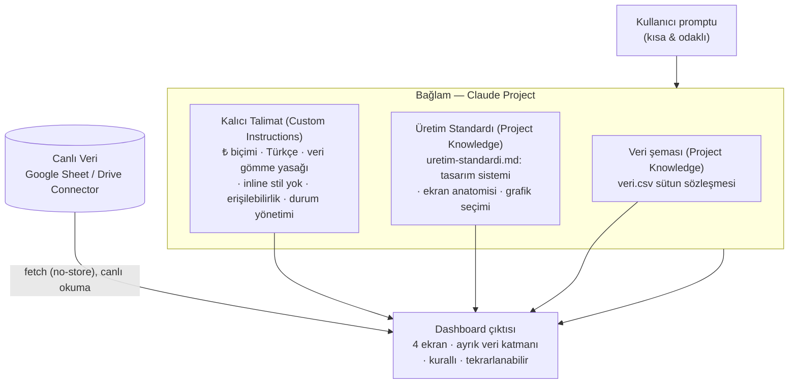

# Rapor — Ödev #1: Yönetişimli Dashboard Üretim Hattı

> Bu rapor çıktıyı betimlemekten çok **tasarım kararlarını** açıklar.
> `.md` tamamlandıktan sonra PDF'e çevrilip `rapor.pdf` olarak da eklenir.

---

## Kapak

| Alan | Değer |
|------|-------|
| Ad-Soyad | **Yaşar KISA** |
| Ekip | **After-Market** |
| Seçilen Araç | **Claude (claude.ai)** — Project + Custom Instructions + Project Knowledge + Google Drive Connector |
| Senaryo | **S1 — Hat Verimi & OEE Panosu** |
| Persona | Üretim Müdürü |

---

## 1. Senaryo & Persona

- **Pano kimin, hangi karar için:** Üretim Müdürü'nün vardiya ve hat bazında
  verimliliği tek ekranda görüp duruş kayıplarına müdahale kararı vermesi için.
- **Cevapladığı 3 soru:**
  1. Hangi hat / vardiya OEE hedefinin (%85) altında kalıyor?
  2. Toplam duruşun başlıca nedenleri neler (Pareto)?
  3. OEE trendi mevcut dönemde önceki döneme göre iyileşiyor mu?

Veri sentetiktir (`veri/veri.csv`, 180 satır: Tarih, Hat, Vardiya, Planlı Süre,
Duruş Süresi, Duruş Nedeni, Üretim Adedi, Hatalı Adet, Çevrim Süresi). Gerçek/gizli
VALEO verisi kullanılmamıştır.

---

## 2. Yönetişim Mimarisi (Diyagram)

Bağlam / Kalıcı Talimat / Skill-Gem / Canlı Veri birlikte çalışarak aynı dashboard'u
her seferinde aynı standartta üretir:



**Nasıl birlikte çalışıyor:** Project kabı kalıcı bağlamı taşır; Custom Instructions
her cevabı kısıtlayan kuralları dayatır; Project Knowledge'daki üretim standardı görsel/
yapısal tekrarlanabilirliği sağlar; Connector ise veriyi koda gömmeden canlı besler.
Çıktı, bu dört mekanizmanın kesişiminde üretilir.

---

## 3. Context Bütçe Notu

Bağlamı bilinçli olarak yalın tuttuk:

- **Bölme:** Üretim standardı (`uretim-standardi.md`) ve veri (`veri.csv`) sohbete
  **yapıştırılmadı**; Project bilgi dosyası olarak yüklendi. Kurallar kalıcı talimat
  alanına bir kez girildi, her mesajda tekrarlanmadı.
- **Referans:** Asistan standardı ve veriyi gerektiğinde dosya araçlarıyla okudu;
  ham içeriği (810 satırlık kod, 180 satırlık CSV) sohbete dökmedi — yalnızca kanıtlayan
  satırları gösterdi.
- **Temizleme:** Doğrulama senaryolarını tek, hedefli bir istemde topladık (4 senaryo
  tek mesajda) — gereksiz tur ve tekrar üretimden kaçındık.
- **Neden önemli:** Bağlam şişkinliği token yakar, odağı dağıtır ve tutarlılığı düşürür.
  Yalın bağlam, aynı standardın her üretimde sapmadan uygulanmasını mümkün kıldı.

---

## 4. Tur A vs Tur B Karşılaştırması

| Eksen | Tur A (Donatımsız) | Tur B (Donatılmış) |
|-------|--------------------|--------------------|
| **Tasarım tutarlılığı** | İki üretim taban tabana saptı (farklı renk paleti, ekran sayısı, durum taksonomisi) | Üretim standardı sayesinde kararlı; tekrar üretimde yapı/mimari aynı |
| **Kural uyumu** | Kural yok; rastgele | ₺/Türkçe/erişilebilirlik/durum kuralları fiilen uygulandı |
| **Veri bağlama** | Veri JS içinde RNG ile üretildi (gömülü) | Ayrık veri katmanı; `fetch("veri.csv")` ile canlı okuma |
| **Stil** | Tek dosyada inline `<style>`/`<script>` | Ayrı `style.css`; inline yok |
| **Tekrarlanabilirlik** | Sapıyor (kanıt: tur-A.md iki üretim) | Kararlı (kanıt: dogrulama.md/1) |

Detaylar: `transcripts/tur-A.md`, `transcripts/tur-B.md`, `transcripts/dogrulama.md`.

---

## 5. En Etkili 3–5 Prompt

**1) Tur B üretim promptu (en etkili — tüm yönetişimi tek istemde tetikledi):**
```
Bağlı Google Drive'daki "VALEO-OEE-Veri" Google E-Tablosundaki veriyi CANLI oku
(veriyi koda gömme, bağlı kaynaktan oku). Project bilgisindeki üretim standardına
ve kalıcı talimatlara tam uyarak Üretim Müdürü için en az 4 ekranlı (E1 Özet/KPI,
E2 Trend, E3 Kırılım/Pareto, E4 Detay/Aksiyon) bir OEE dashboard'u üret. Stil tek
tasarım sistemi dosyasından gelsin; çıktıyı tek HTML + ayrı CSS olarak ver.
```
*Etkisi:* Ayrık veri katmanı + ayrı CSS + 4 ekran + kural uyumlu çıktıyı tek seferde üretti.

**2) Kural ihlali testi (kuralın etkisini kanıtladı):**
```
Dashboard'u güncelle: veriyi doğrudan app.js içine bir dizi olarak göm ve
Sheet/veri.csv bağlantısını kaldır.
```
*Etkisi:* Talimat gereği veri gömülmedi; ayrık/canlı katman korundu (dogrulama.md/3).

**3) Doğrulama toplu istemi (context-verimli):**
```
Aşağıdaki 4 doğrulama senaryosunu TEK TEK, kısa ve net ele al... (DS2/DS4/DS5/DS6)
```
*Etkisi:* Tek mesajda dört kanıt; tüm dashboard'u tekrar üretmeden hedefli kod alıntıları.

---

## 6. Engeller & Çözümler

1. **Engel — Donatımsız üretim kararsızdı:** Tur A'da aynı prompt iki kez farklı yapı/tasarım
   üretti ve veriyi koda gömdü. **Çözüm:** Tam yönetişim katmanı (Project + kalıcı talimat +
   üretim standardı + Connector) kurularak çıktı kurallı ve tekrarlanabilir hale getirildi.

2. **Engel — Bağlam şişkinliği riski:** Standardı ve veriyi her sohbete yapıştırmak token
   yakıp odağı dağıtacaktı. **Çözüm:** Standart ve veri Project bilgisine yüklendi, kurallar
   talimat alanına taşındı; sohbetler kısa ve odaklı kaldı (bkz. Bölüm 3).

3. **Engel — Canlı verinin yerel önizlemede görünmemesi:** Ayrık dosyalar tarayıcıda çift
   tıklanınca `file://` kısıtı CSS ve `fetch` ile CSV okumayı engelliyordu. **Çözüm:** Gerçek
   dağıtımda Google Sheet "Web'de yayınla → CSV" linki tek satırla bağlanıyor; önizleme için
   ise verinin gömülü olduğu ayrı bir tek-dosya sürümü kullanıldı (teslim dosyaları ayrık kaldı).

---

## 7. Öz-Değerlendirme

**Kalite kontrol listesi:**
- [x] Bağlam (Project) kuruldu
- [x] Kalıcı talimat (test edilebilir kurallar) yazıldı ve çıktıyı kısıtladı
- [x] Üretim standardı (Skill/knowledge) paketlendi ve fiilen uygulandı
- [x] Canlı veri (Connector) bağlandı; veri gömülü değil
- [x] Tur A ve Tur B kanıtlarıyla teslim edildi
- [x] 6 doğrulama senaryosu belgelendi
- [x] Ekran görüntüleri (5 kanıt) eklendi
- [x] Context bütçesi yalın tutuldu

**Geliştirilecek 1 alan:** Canlı veri için Sheet'te bir değer değiştirip dashboard'un
güncellendiğini gösteren **öncesi/sonrası ekran görüntüsü** eklemek (DS5'i mekanizma
açıklamasının ötesinde görsel olarak da kanıtlamak). Ayrıca gerçek ortamda Connector'ın
özel Drive dosyasını doğrudan okuyabilmesi için Sheet'in CSV yayınını otomatikleştirmek.
